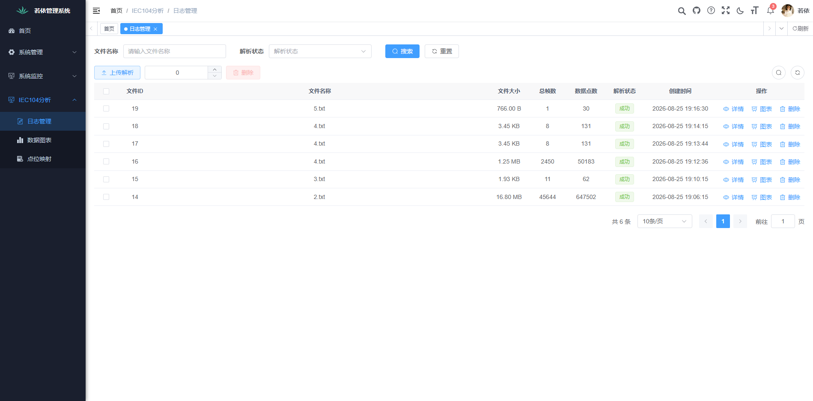
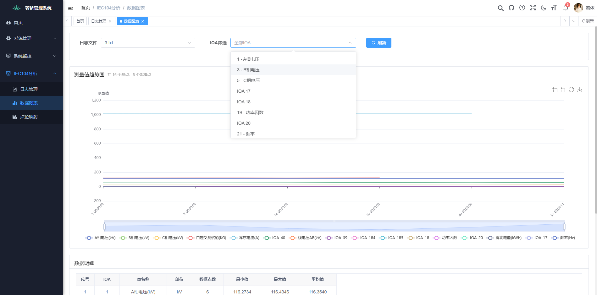
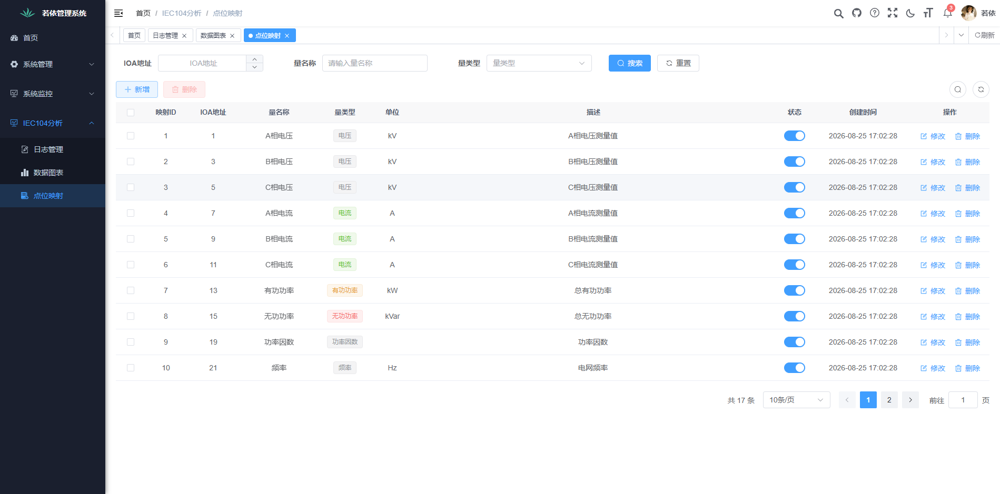

 
<h1 align="center" style="margin: 30px 0 30px; font-weight: bold;">iec104协议监控分析</h1>
<h4 align="center">基于若依实现的iec104协议监控分析平台</h4> 

## 平台简介
* 前端采用Vue、Element（提供 Vue2/Vue3/TS 多版本）。
* 后端采用Spring Boot、Spring Security、Redis & Jwt。
* 基于Jwt的Token认证，支持多终端（Web、App、小程序）无缝接入。
* 支持加载动态权限菜单，多方式轻松权限控制，细粒度到按钮级别。
* 内置强大代码生成器，一键生成前后端代码（java、vue、xml、sql），支持 CRUD 下载。 
* 默认账号密码为 admin/admin123，生产环境请务必修改

## 截图
IEC104日志上传解析
日志图示分析
iec日志名词映射
